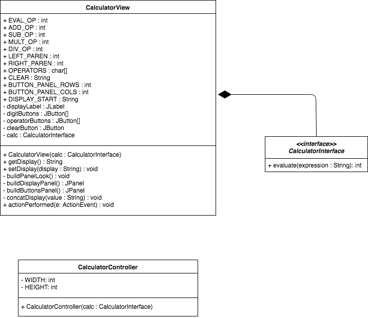
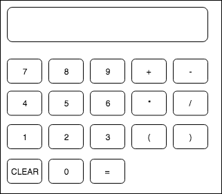
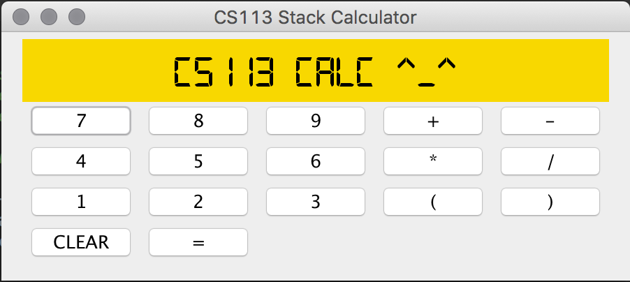

# CS113-GP2-StackIntegerCalculator
## GP #2 for CS113 - Stack Integer Calculator MVC project (using Agile Development/Scrum)

**[]**

>The model-view-controller (MVC) is an architectural pattern commonly used with graphical user interfaces (GUI). The MVC splits application into three interconnected parts. This is done to allow for efficient code reuse and parallel development. The relation is thus - the user sees the View and uses the Controller which in turn manipulates the Model which updates the View.

You have been given a View and Controller for a basic integer calculator, **you are to integrate a Model** which will take input from the Controller and update the View.  **Make sure your Model throws appropriate exceptions** (either use built-in Java ones or your own created/custom ones) for errors and handle the errors in `CalculatorView.actionPerformed()` appropriately (*hint*: GUIs!).  **You must provide JUnit tests for the methods within your Model** (that includes the overriden `evaluate()` method), make sure to put any JUnit testers in a `tests` directory.  Finally, **make sure to keep your UML class diagrams for your project updated** for each sprint, you are given the UML diagram for the start of this project (you are also given the HTML file to edit in [draw.io](https://www.draw.io/)). Any documentation should go in the `doc` directory, don't forget to update this markdown file to add the image in the placeholder at the end.

**Your model should use a stack data structure to evaluate integer expressions**, account for the order of operations for addition, subtraction, multiplication, division and parentheses.  **As well, integrate one of the following** :
 - ***Polynomial Arithmetic***
	Integrate your previously built Polynomial and Term classes to allow for addition, subtraction and multiplication of a term unto a polynomial.
	*Ex.* `3x * (4x^2 + 2x)` = `12x^3 + 6x^2`
 - ***Simple Derivatives***
	Allow for terms with your previously built Term class and allow for simple derivation of single terms.
	*Ex.* `3x^2` = `6x`
 - ***Vector Operations***
	Allow for entry of vectors and add dot product, cross product and scalar multiplication. 

### Stack Integer Calculator  – UML Class Relationship Diagram

### Stack Integer Calculator - Wireframe

### Stack Integer Calculator - Final GUI Screenshot

----------

***Remember that at the end of each sprint you should have a working produce to showcase (each week there will be a check-in during class time).  Make sure to keep your Trello board updated as well!***

----------

## Sprint 0 (Planning sprint)
- [ ] Gather requirements
- [ ] Think, dialogue with partner, and make some big technical decisions (decide on data structure(s) that is/are the most reasonable for implementation, classes to create, methods for each, diagrams, etc.)
- [ ] Create detailed description of what you are accomplishing/doing
- [ ] Breakdown into two logical/doable sprints (Sprint 1 and Sprint 2)
- [ ] Formally define **each** sprint with the following (*see Topic 1 for more details*):
	- [ ] User Story (1-2 sentences in everyday language of end user that summarizes what needs to be developed)
	- [ ] Create list of tasks and tests, using an Agile task board to keep track (Trello)
	- [ ] Create definition of done (required for every sprint):
		- *Code adheres to coding standard/convention*
		- *Code is documented*
		- *Code checked into GitHub*
		- *Unit tests were written, all pass*
		- *Relevant diagrams and documentation updated and accurate (UML class/sequence diagrams, etc.)*
- [ ] Complete following statement in space below:
>The Stack implementation we will be using is [***type which data structure you'll use in this adaptor pattern***] because [ ***type your reasoning here in 2-3 sentences, making sure to justify the way we have in class (run-time efficiency, memory-space efficiency, etc.)*** ].

## Sprint 1 (Calculator Foundation, add using PEMDAS)
**User Story**:
>As a ***programmer using the calculator program*** I want to ***add, subtract, multiply, and divide numbers correctly using PEMDAS (Parentheses, Exponents, Multiplication, Add, Subtract)*** so that ***the numbers will be evaluated correctly and outputted to the user***.

**Definition Of Done**:
- [ ] General requirements 
	- *Code adheres to coding standard/convention*
	- *Code is documented*
	- *Code checked into GitHub*
	- *Unit tests were written, all pass*
	- *Relevant diagrams and documentation updated and accurate (UML class/sequence diagrams, etc.)*
- [ ] Create code that would allow the following
    - [ ] Add positive numbers
    - [ ] Subtract positive numbers
    - [ ] Multiply positive numbers
    - [ ] Divide positive numbers
- [ ] Corporate PEMDAS so that the program calculates the values correctly
- [ ] Create JUnit tests for the above code make sure the following tests work correctly
- [ ] Product owner agrees

## Sprint 2 (???)
**User Story**:
>As a ***???*** I want to ***???*** so that ***???***.

**Definition Of Done**:
- [ ] General requirements 
	- *Code adheres to coding standard/convention*
	- *Code is documented*
	- *Code checked into GitHub*
	- *Unit tests were written, all pass*
	- *Relevant diagrams and documentation updated and accurate (UML class/sequence diagrams, etc.)*
- [ ] Product owner agrees

----------
### Make sure to commit + push *before* the deadline to have your code be considered for grading.
>Pro-Tips:
>- Make sure to assign each other tasks, its easier to track and handle than assigning each other files/methods to create.  It also helps your instructor in grading, so make sure at the end of the sprint that the Trello board is accurate with who was involved in which task (if you helped debug, add yourself to the task and leave a comment about it!)
>- Put in as much time/effort into Sprint 0 and see how much you and your partner can anticipate! If there's anything you missed, keep track of it in the space below this! That way, at the end of a sprint/the whole project, you can see what kinds of things you missed.  Do you notice any patterns?
>- Don't forget to breakdown your project into sprints and have a deliverable product at the end of Sprint 1 and Sprint 2
